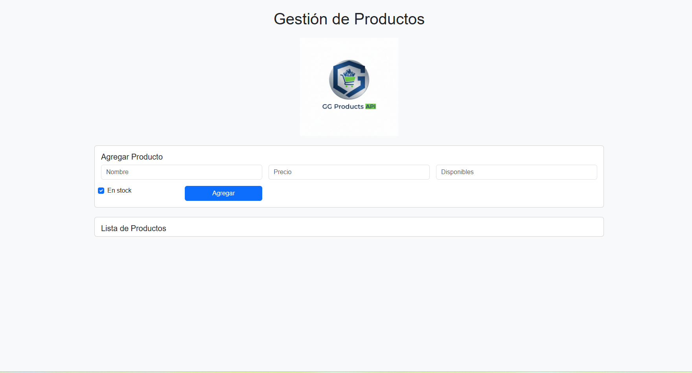
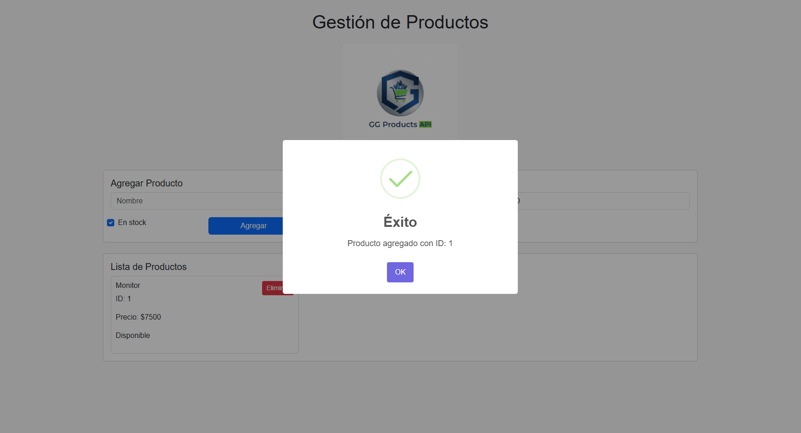
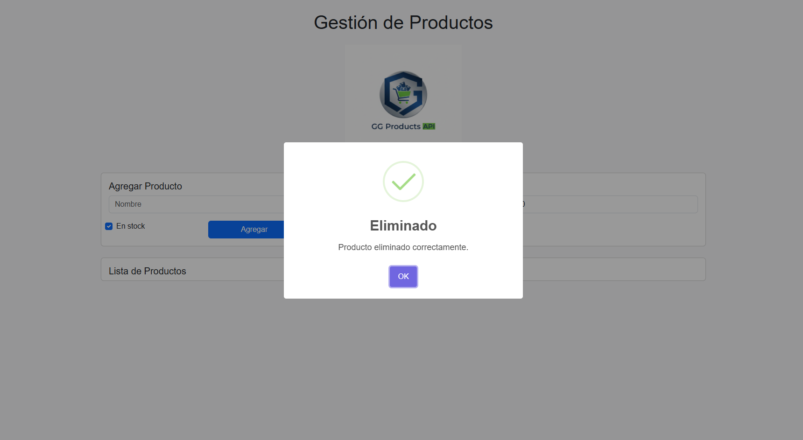
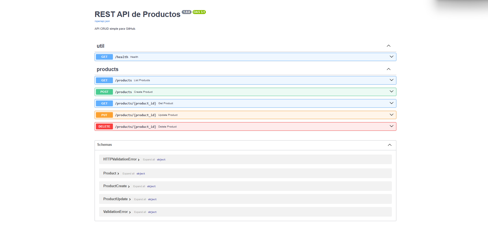

# REST API de Productos(FastAPI)


## 🚀 Tecnologías
- FastAPI (docs automáticas)
- Uvicorn
- Pydantic
- Pytest

## ▶️ Cómo correr
```bash
python -m venv .venv
source .venv/bin/activate 
pip install -r requirements.txt
uvicorn app.main:app --reload
```
# Tambien puedes usar el archivo (setup_and_run_api.bat)

- Abre **http://127.0.0.1:8000/docs** para probar la API (Swagger UI).
- Esquema OpenAPI en **/openapi.json**.

## 🧪 Pruebas
```bash
pytest -q
```

## 🔧 Endpoints
- `GET /health`
- `GET /products`
- `GET /products/{id}`
- `POST /products` (body: `{name, price, in_stock}`)
- `PUT /products/{id}` (body parcial)
- `DELETE /products/{id}`

## 🧰 Ejemplos cURL
```bash
curl http://127.0.0.1:8000/products
curl -X POST http://127.0.0.1:8000/products   -H "Content-Type: application/json"   -d '{"name":"Monitor","price":120.0,"in_stock":true}'
curl -X PUT http://127.0.0.1:8000/products/3 -H "Content-Type: application/json" -d '{"price":130.0}'
curl -X DELETE http://127.0.0.1:8000/products/3
```
<p><h3>Inicio</></p>


### Inicio


### Agregar Producto


### Eliminar


### API


## 📦 Nota
Esta API usa almacenamiento en memoria (Por el momento). Si reinicias, los datos se pierden.

🧱 Estructura del proyecto
rest-api-mini/
├─ app/
│  ├─ main.py
│  ├─ models.py
│  └─ data.py
├─ tests/
│  └─ test_api.py
├─ requirements.txt
├─ README.md
└─ .gitignore


by: Jefferson Hidalgo